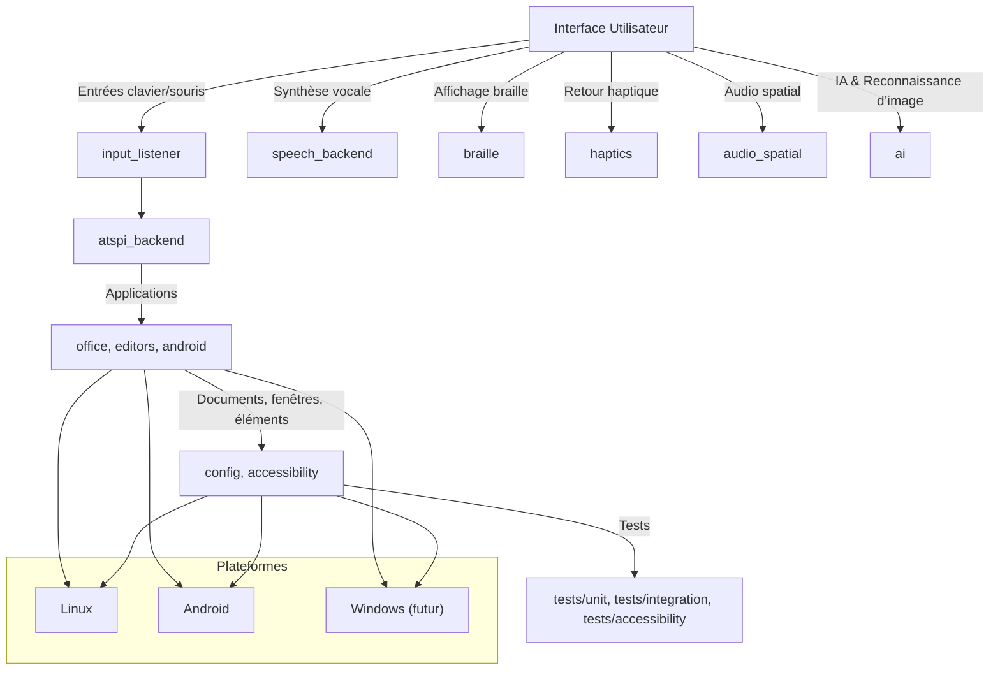

# Schéma d’architecture du projet NVDA Linux

Ce document détaille l’architecture globale du projet NVDA Linux, en illustrant les principaux modules et leurs interactions.

## Diagramme d’architecture

## Explications détaillées

- **Interface Utilisateur (A)**  
  Ce module constitue la façade de l’application. Il reçoit les entrées (clavier, souris) et déclenche les sorties (synthèse vocale, affichage braille, retour haptique, audio spatial, IA et reconnaissance d’image).

- **input_listener (B)**  
  Ce module intercepte les entrées (clavier, souris) et les transmet au backend AT-SPI (H) afin de communiquer avec les applications (I).

- **speech_backend (C)**  
  Ce module gère la synthèse vocale (par exemple, via espeak ou un autre moteur) afin de lire à voix haute les informations (textes, notifications, etc.).

- **braille (D)**  
  Ce module pilote l’affichage braille (par exemple, via BRLTTY ou un autre pilote) afin de traduire le texte en braille.

- **haptics (E)**  
  Ce module gère le retour haptique (vibrations, retour tactile) afin de fournir un retour tactile à l’utilisateur.

- **audio_spatial (F)**  
  Ce module gère l’audio spatial (son 3D, spatialisation) afin de restituer des sons en 3D (par exemple, pour indiquer la position d’un élément dans l’espace).

- **ai (G)**  
  Ce module intègre l’intelligence artificielle et la reconnaissance d’image (OCR, reconnaissance d’objets, description d’interface) afin d’analyser et de décrire l’environnement (par exemple, pour décrire une image ou une interface).

- **atspi_backend (H)**  
  Ce module constitue le backend AT-SPI (Assistive Technology Service Provider Interface) qui communique avec les applications (I) (par exemple, LibreOffice, éditeurs, applications Android) afin de récupérer les informations (textes, éléments, états, etc.).

- **Applications (I)**  
  Ce groupe représente les applications (par exemple, LibreOffice, éditeurs, applications Android) qui sont interrogées par le backend AT-SPI (H) afin de fournir les informations (documents, fenêtres, éléments) à l’utilisateur.

- **config, accessibility (J)**  
  Ce module regroupe la configuration et les fonctionnalités d’accessibilité (contraste, raccourcis, loupe, etc.) afin de personnaliser le comportement de NVDA Linux.

- **Tests (K)**  
  Ce module regroupe les tests (unitaires, intégration, accessibilité) afin de garantir la qualité et la robustesse du projet.

- **Plateformes (L, M, N)**  
  Ce sous-graphe représente les plateformes cibles (Linux, Android, et à terme Windows) sur lesquelles NVDA Linux est déployé. Les applications (I) et la configuration (J) interagissent avec ces plateformes.

## Interactions entre les modules

- L’**Interface Utilisateur (A)** reçoit les entrées (clavier, souris) et déclenche les sorties (synthèse vocale, braille, retour haptique, audio spatial, IA) afin de restituer l’information à l’utilisateur.
- Le module **input_listener (B)** intercepte les entrées et les transmet au **atspi_backend (H)** afin de communiquer avec les **Applications (I)** (par exemple, LibreOffice, éditeurs, applications Android).
- Le **atspi_backend (H)** interroge les applications (I) afin de récupérer les informations (documents, fenêtres, éléments) et les transmet aux modules de sortie (C, D, E, F, G) afin de les restituer à l’utilisateur.
- Le module **config, accessibility (J)** permet de personnaliser le comportement (contraste, raccourcis, loupe, etc.) et interagit avec les plateformes (L, M, N) afin de s’adapter à l’environnement (Linux, Android, Windows).
- Les **Tests (K)** (unitaires, intégration, accessibilité) garantissent la qualité et la robustesse du projet.

Ce schéma d’architecture constitue une base pour comprendre l’organisation globale du projet NVDA Linux et pour guider le développement futur. 